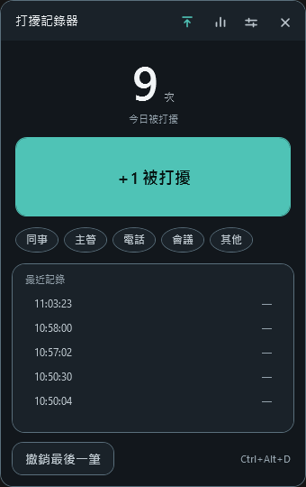
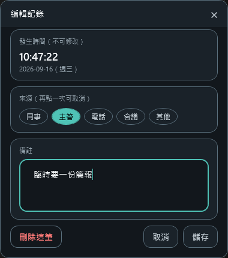
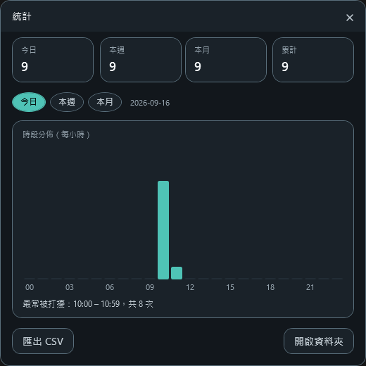
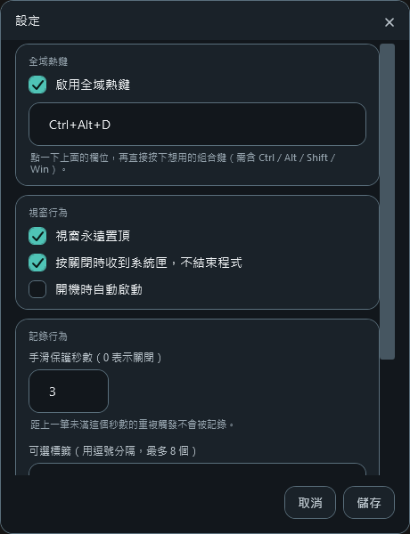

# 打擾記錄器（Stop Annoying Me）

上班被同事、主管或電話打斷時，按一下按鈕（或一個熱鍵）記下當時的時間，並統計今天被打擾幾次。

常駐桌面、可置頂、可收到系統匣。設計目標只有一個：**從「被打擾」到「記錄完成」不超過一個動作，而且不必離開手上的工作。**

| 主畫面 | 編輯記錄 | 統計 | 設定 |
|---|---|---|---|
|  |  |  |  |

---

## 下載與執行

到 [Releases](https://github.com/marvin3991/stop-annoying-me/releases/latest) 下載，兩種版本擇一：

| 檔案 | 大小 | 需要什麼 |
|---|---|---|
| `StopAnnoyingMe.exe` | 約 2.5 MB | 電腦需已安裝 [.NET 10 Desktop Runtime](https://dotnet.microsoft.com/download/dotnet/10.0) |
| `StopAnnoyingMe-selfcontained.exe` | 約 150 MB | 不需要，Runtime 已包在裡面 |

兩者功能完全相同。下載後放到任何資料夾直接執行即可 —— 單一執行檔、免安裝、不寫 Program Files、不需要系統管理員權限。

> Windows SmartScreen 可能會因為執行檔沒有程式碼簽章而跳出警告。這支程式沒有付費簽章憑證；
> 介意的話請照下方「自行建置」自己編譯。

環境需求：Windows 10 1809 以上（x64）。

### 自行建置

需求：.NET SDK 10、PowerShell 7。

```powershell
pwsh -File tools/publish.ps1
```

腳本會先跑完整單元測試，測試沒過就不產生輸出；接著重新產生圖示，最後把單一執行檔輸出到 `dist\`。

不需要對方安裝 Runtime 時：

```powershell
pwsh -File tools/publish.ps1 -SelfContained
```

開發時的一般指令：

```powershell
dotnet build
dotnet test
dotnet run --project src/StopAnnoyingMe.App
```

---

## 使用方式

| 想做的事 | 怎麼做 |
|---|---|
| 記一次打擾 | 點主畫面的「＋1 被打擾」，或按熱鍵 `Ctrl+Alt+D`（預設），或從系統匣圖示右鍵選「記一次打擾」 |
| 標記是誰打擾 | 記錄之後點一下標籤（同事／主管／電話／會議／其他）。**再點同一個標籤就取消標記** |
| 補備註／改來源 | **點一下「最近記錄」裡的任一列**，開啟編輯視窗改來源與備註。發生時間不可修改 |
| 按錯了 | 點「撤銷最後一筆」 |
| 刪掉中間某一筆 | 點開那一列 →「刪除這筆」→ 再按「確定刪除」。無法復原 |
| 看統計 | 標題列的長條圖圖示，可切換今日／本週／本月 |
| 匯出資料 | 統計畫面 →「匯出 CSV」，會匯出目前選取期間的所有記錄 |
| 收起來 | 點標題列的 ✕，程式會收到系統匣繼續執行；要真正結束請用系統匣右鍵選「結束」 |

按熱鍵記錄時，螢幕右下角會出現約 2.5 秒的提示，告訴你這是今天第幾次；系統匣圖示上也會直接顯示今日次數。

---

## 規格

### 行為規格

| 項目 | 說明 | 範圍／限制 |
|---|---|---|
| 記錄內容 | 發生時間（本地時間，精確到秒）、可選來源標籤、可選備註 | 不記錄打擾持續時間 |
| 手滑保護 | 距上一筆未滿 N 秒的重複觸發不寫入，並顯示提示 | 預設 3 秒；可在設定改為 0–3600，0 表示關閉 |
| 撤銷 | 只刪除「今天」的最後一筆 | 今天沒有記錄時按鈕停用；不會動到昨天的資料 |
| 標籤 | 標記今天最後一筆的來源，再點一次取消 | 最多 8 個標籤；不標記不影響記錄 |
| 編輯記錄 | 點清單中的任一列改來源與備註 | 備註最多 500 字；發生時間不可修改；按取消不會寫入 |
| 刪除記錄 | 在編輯視窗刪掉任一筆，不限今天、不限最後一筆 | 需二次確認；刪除後無法復原（撤銷只能救最後一筆） |
| 今日次數 | 以本地日期計算，跨午夜自動歸零 | 每 30 秒檢查一次日期變更 |
| 本週 | 週一為一週之始 | 台灣工作週慣例 |
| 本月 | 當月 1 日至月底 | 自動處理閏年二月與跨年 |
| 時段分佈 | 每小時一格，共 24 格 | 沒有記錄的時段顯示為 0 |
| 全域熱鍵 | 預設 `Ctrl+Alt+D`，背景可用 | 必須含 Ctrl／Alt／Shift／Win 至少一個；主鍵支援 A–Z、0–9、F1–F24 與常用編輯鍵；按住不會連發 |
| CSV 匯出 | 欄位：發生日期、發生時間、星期、來源、備註 | UTF-8 with BOM，Excel 直接開啟不亂碼 |

### 資料位置

| 檔案 | 路徑 | 內容 |
|---|---|---|
| 資料庫 | `%LOCALAPPDATA%\StopAnnoyingMe\data.db` | SQLite，所有打擾記錄 |
| 設定 | `%LOCALAPPDATA%\StopAnnoyingMe\settings.json` | 熱鍵、置頂、標籤、視窗位置等 |
| 錯誤記錄 | `%LOCALAPPDATA%\StopAnnoyingMe\error.log` | 未預期例外，超過 512 KB 自動輪替 |

資料表 `interruptions`：

| 欄位 | 型別 | 說明 |
|---|---|---|
| `id` | INTEGER | 主鍵 |
| `occurred_at` | TEXT | 本地時間 `yyyy-MM-ddTHH:mm:ss` |
| `occurred_date` | TEXT | 本地日期 `yyyy-MM-dd`，供索引與分組 |
| `source` | TEXT NULL | 來源標籤 |
| `note` | TEXT NULL | 備註 |
| `created_at` | TEXT | 寫入時間 |

### 例外處理

| 情境 | 行為 |
|---|---|
| 資料庫檔損毀 | 改名為 `data.db.corrupt-<時間戳>.bak` 保留，重建空白資料庫，主畫面顯示警告。**不刪使用者資料** |
| 設定檔損毀 | 改名保留，回落到預設值，程式照常啟動 |
| 熱鍵被其他程式佔用 | 主畫面提示「已被其他程式佔用」並可到設定改鍵，記錄功能不受影響 |
| 匯出時檔案被佔用 | 顯示明確訊息，不中斷程式 |
| 系統匣不可用 | 降級為一般視窗模式 |
| 開機自啟寫入登錄檔失敗 | 顯示錯誤並把設定回復為關閉 |
| 重複啟動 | 喚回既有視窗，新行程結束 |
| 未預期例外 | 寫入 `error.log`、提示使用者，程式繼續執行 |

---

## 專案結構

```
src/StopAnnoyingMe.Core        純邏輯（資料存取、統計、設定、熱鍵解析），無 UI 相依
src/StopAnnoyingMe.App         WPF 介面、系統匣、全域熱鍵
tests/StopAnnoyingMe.Core.Tests xUnit，115 個測試
tools/generate-icon.ps1        由向量路徑產生多尺寸 app.ico
tools/publish.ps1              跑測試 → 產圖示 → 輸出單一執行檔到 dist\
docs/                          設計規格、視覺設計說明、截圖
```

核心邏輯與 UI 分離，時間相關的計算都以「傳入的今天」為基準，所以跨日、跨週、跨月、閏年等邊界都能直接測試。

---

## 相依套件

| 套件 | 版本 | 用途 |
|---|---|---|
| Microsoft.Data.Sqlite | 10.0.12 | SQLite 存取 |
| xunit | 2.9.3 | 單元測試（僅測試專案） |
| xunit.runner.visualstudio | 3.1.4 | 測試執行器（僅測試專案） |
| Microsoft.NET.Test.Sdk | 17.14.1 | 測試主機（僅測試專案） |
| coverlet.collector | 6.0.4 | 涵蓋率收集（僅測試專案） |

執行階段另外用到 .NET 內建的 WPF 與 WinForms（只用 `NotifyIcon` 做系統匣），沒有其他第三方相依。

---

## 開發備註

- 目標框架：`net10.0`（Core／測試）、`net10.0-windows`（App）
- 視覺主題在 `src/StopAnnoyingMe.App/Themes/Design.xaml`，色票與對比值記在 [docs/design-notes.md](docs/design-notes.md)
- 設計決策與邊界條件清單在 [docs/superpowers/specs/2026-09-16-interruption-tracker-design.md](docs/superpowers/specs/2026-09-16-interruption-tracker-design.md)
- CSV 匯出不對以 `=`、`+`、`-`、`@` 開頭的欄位做跳脫；資料來自使用者自己輸入的備註，優先保持內容原樣

## 授權

[MIT](LICENSE)
